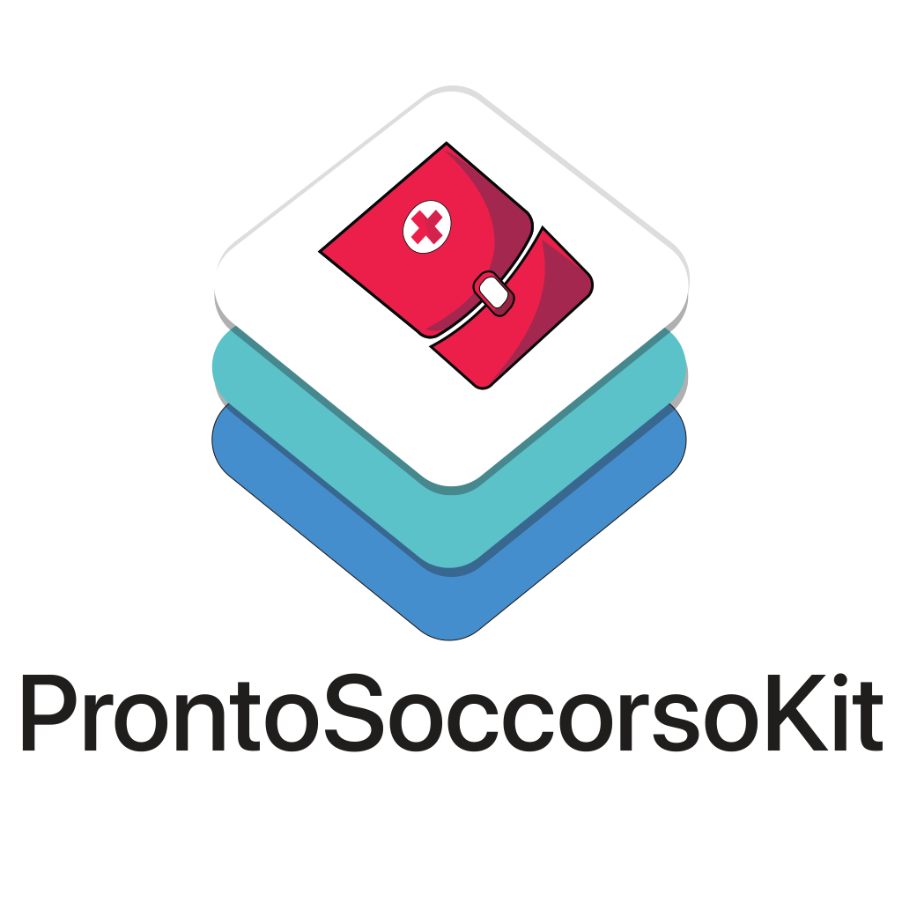

<p align="center">

</p>

Artwork & demo app icon kindly provided by [Alessandro Vercellino](mailto:independentdesign@outlook.it).

## Usage

```swift
ProntoSoccorso.region(.lazio).fetch { result in
    // Handle result
}

ProntoSoccorso.regions([.lazio, .friuliVeneziaGiulia]).fetch { result in
    // Handle result
}

```

## Available regions / municipalities

- [X] Lazio 
- [X] Friuli-Venezia Giulia
- [ ] Puglia
    - [X] Taranto
- [ ] Trentino-Alto Adige
    - [X] Trento
- [ ] Lombardia
    - [X] Valtellina E Alto Lario

## Scraping

Most of the data is scraped from websites, hence fetching times may vary.

Scraping is done by adding a hidden `WKWebView` behind all other views in the `keyWindow`.
Once the web view finishes loading, the post-render HTML is then parsed with `SwiftSoup` and the data populated.

# Demo App


A demo app is included to show the currently availble data, and how to fetch it.

# Installation

```
```

## App Transport Security

```
```
# Contribute

```
```

# License

